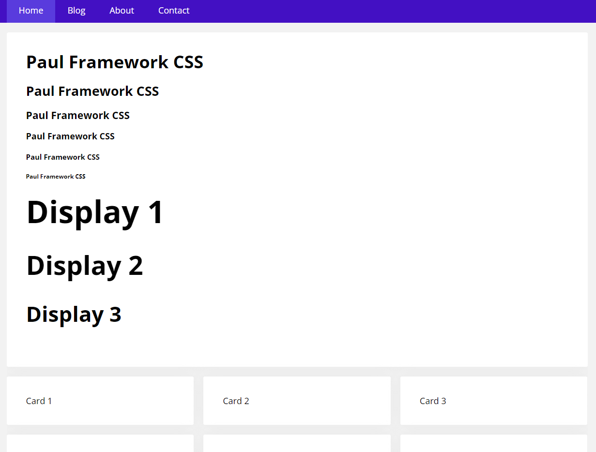

## Paul Framework CSS



## Description

CSS Framework, developed in 2021.

## Index

- [Instalation](#instalation)
- [Live Preview](#live-preview)
- [License](#license)

## Instalation

```
git clone https://github.com/olivierpaulcris/paulframeworkcss.git
git checkout master
```

## Live Preview

[Live Preview](https://66eafac67e08fb4c48649653--neon-rolypoly-d3e6c3.netlify.app/)

## License

GNU GENERAL PUBLIC LICENSE. Version 3, 29 June 2007. Copyright (C) 2007 Free Software Foundation, Inc. <https://fsf.org/> Everyone is permitted to copy and distribute verbatim copies of this license document, but changing it is not allowed.
